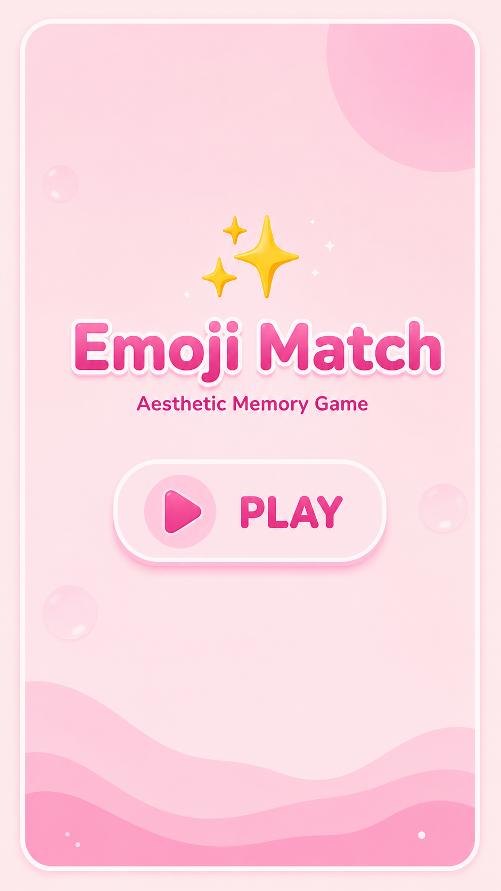
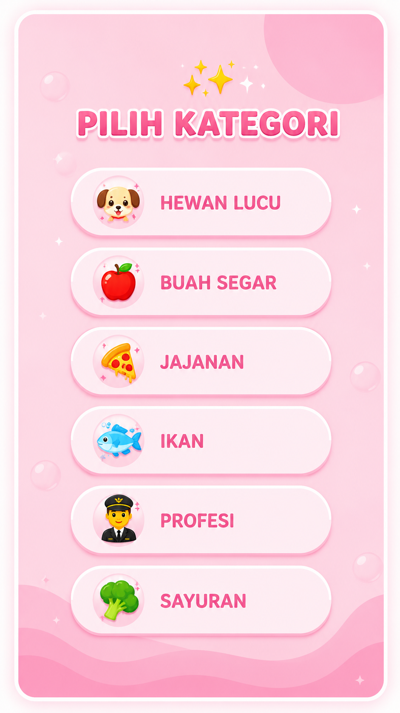
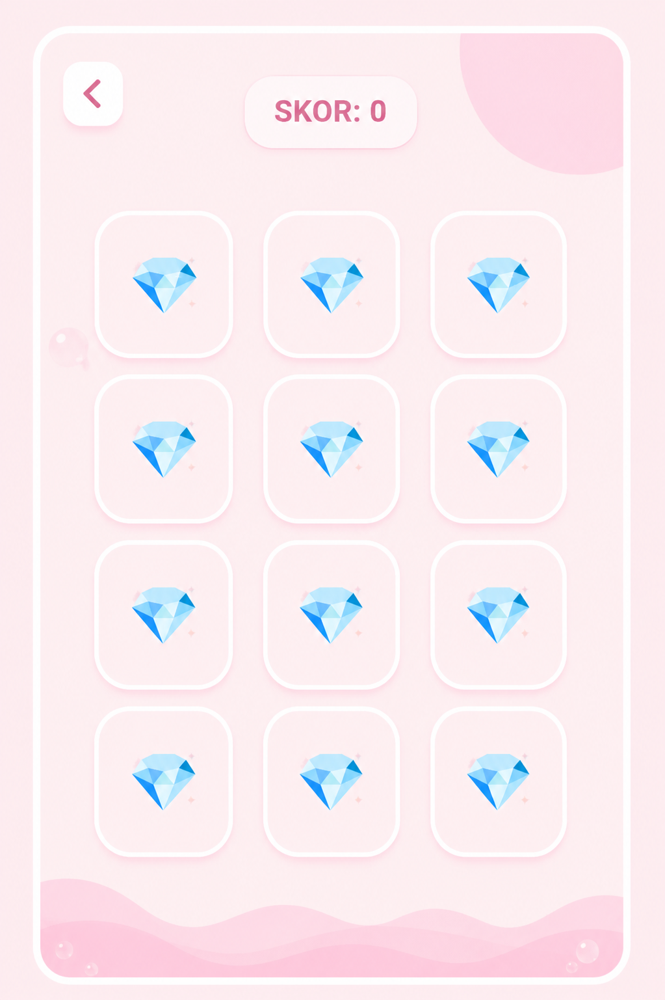
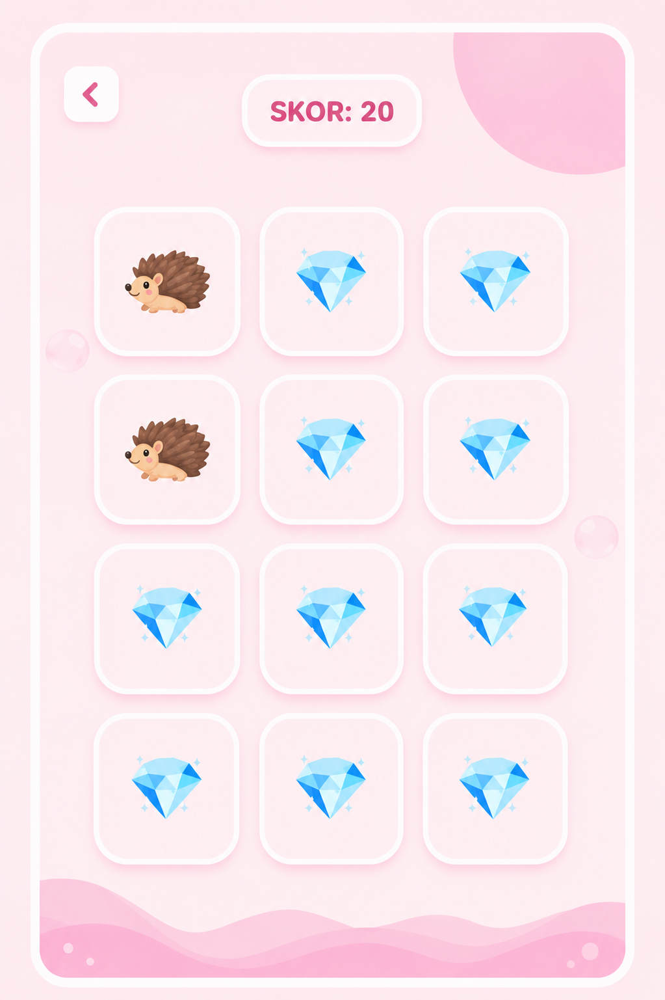
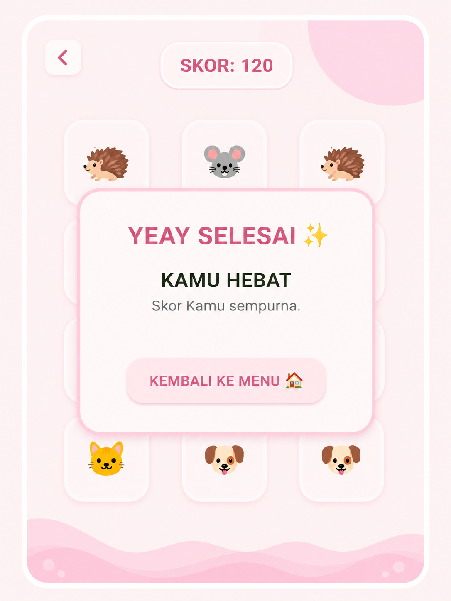

# 🌟 Emoji Match - Aesthetic Memory Game

---

## 1.KOMPONEN 1: BLUEPRINT (RENCANA KERJA APLIKASI)

### 1. Tema & Konsep Utama Visual
Aplikasi ini adalah game edukasi asah memori (*Memory Card Game*) interaktif. Antarmuka dirancang dengan gaya minimalis-estetic menggunakan palet warna pastel yang lembut agar nyaman di mata dan memberikan kesan elegan:
* '#FFE4E1' (Misty Rose) - Latar belakang utama. 
* '#FFB6C1' (Linht Pink Menyala) - Gradasi warna cerah aksen visual.
* '#FFF0F5' (Lavender Blush) - Sentuhan warna lembut pelengkap.
* '#D87093' (Pale Violet Red) - Warna teks utama dan *border* konstras.
* '#FADADD' (Soft Pink) - Warna dasar kartu saat tertutup (💎) dan tombol.

### 2. Arsetektur Komputer Widget (Dart)
Proyek ini mengimplementasikan struktur komponen terpisah (*Component-Driver*) sebagai berikut:
* 'EmojiGameApp': *Root* pengatur tema global Material 3.
* 'BackroundAesthetic': Reusable widget untuk gradasi latar belakan dan ord cahaya menyala.
* 'MainMenuScreen': Antarmuka awal (Layar Menu Utama) + tobol PLAY.
* 'VariantSelectionScreen': Layar pemilihan kategori game (Hewan, Buah, Jajanan).
* 'GamePlayScreen': Papan permainan utama berukuran grid dinamis,
* 'BalloonAnimation': Komponen animasi menggunakan 'AnimationController' untuk selebrasi kemenangan.
* 'AnimatedCuteButton': Widget tombol interaktif dengan efek membal (*floating animation*).

## # 3. Intruksi Penyimpanan Proyek Ke GIT (Commit)
Sesuai instruksi untuk melakukan pembaruan berkala dan dilarang melakukan satu kali push langsung selesai di akhir, aba-aba perintah terminal berikut digunakan setiap  kali selesai mencicil fitur:
* 'git ststus' (Melihat file yang diubah)
* 'git add .' (Menambah perubahan ke staging area)
* 'git commit -m "feat: deskripsi progres fitur"' (Memberikan catatan commit)
* 'git push origin main' (Mengirim berkas ke GitHub)

---

## ⚙️ COMPONEN 2: DOKUMENTASI CARA KERJA & DAFTAR FITUR

## 📸 Tampilan Visual Aplikasi "Emoji Match"
1. Layar Menu Utama ( Menu Utama )
Layar ini adalah titik awal pengguna. Menampilkan judul game, sub-judul, dan tombol "PLAY" yang mengambang untuk memulai permainan. Warna lembut dan elemen bintang bersinar memberikan kesan pertama yang estetis.
 
    

2. Layar Pemilihan Kategori ( Pemilihan Kategori )
Setelah menekan "PLAY", pengguna dibawa ke layar ini. Terdapat enam opsi kategori dengan ikon emoji yang berbeda (Hewan Lucu, Buah Segar, Jajanan, Ikan, Profesi, dan Sayuran) seperti yang tercantum dalam daftar fitur.
 
    

3. Permainan Dimulai: Grid Kosong ( New Game )Setelah memilih kategori (misalnya 'Hewan Lucu'), papan permainan muncul. Ini menunjukkan status awal: SKOR masih 0, dan semua 12 kartu (grid$4 \times 3$) tertutup, menampilkan ikon berlian (💎) standar.
 
    

4. Gameplay: Proses Mencocokkan ( Matching in Progress )
Gambar ini menunjukkan keadaan permainan yang sedang berjalan. Pengguna telah berhasil terjadi satu pasang landak (🦔). Skor telah bertambah menjadi 20. Pengguna baru saja membuka kartu di baris ketiga, satu menampilkan landak (🦔) lain dan satu menampilkan tikus (🐭), bersiap untuk langkah selanjutnya.
 
    

5. Akhir Permainan: Dialog Kemenangan ( Game Over/Skor Sempurna )
Permainan telah diselesaikan. Seluruh 12 kartu telah cocokkan (terlihat di latar belakang). Skor akhir adalah 120 (Sempurna). Dialog kustom estetika muncul dengan teks "YEAY SELESAI ✨" dan "KAMU HEBAT", serta tombol untuk "KEMBALI KE MENU 🏠". Ini sesuai dengan 'Custom Victory Dialog' di dokumentasi.
 
    

### 🛠️ Daftar Fitur Utama
1. **Layar Menu Utama Menarik:** Animasi tombol mengambang (*floating custom button*) interaktif berbasis fungsi trigonometrik matematioka ('math sin') untuk menarik perhatian pengguna.
2. **Sistem Kategori Dinamis:** Pengguna dapat memilih tipe memori berdasarkan 3 kategori mandiri: 🐶 Hewan Lucu, 🍎 Buah Segar, 🍕 jajanan, 🐳 Ikan, 👨‍⚕️ Profesi, dan 🥦 Sayuran.  
3. **Core Memory Match Engine (12 Grid System):** Papan permainan mengunakanukuran grid baru berkapasitas 12 kotak ($4 \times 3$ kolom).Dilengkapi durasi pembalikan kartu otomatis (*Timer* 600ms) untuk menutup kembali kartu jika tebaka pemain tidak cocok.
4. **Sistem Skor & Efek Hadiah:** Penampakan skor dinamis (+20) setiap kali berhasil mencocokkan dengan emoji, serta memicu dekorasi balon meluncur di layar menggunakan sistem 'OverlayEntry'.
5. **Dialog Kemenangan Kustom:** Pop-up *AlertDialog* estetis untuk merayakan penyelesaian game dengan skor sempurna setelah seluruh 12 kartu berhasil dicocokkan tanpa merusak hierarki navigasi halaman.

### 🧠 Logika Alur Kerja Sistem
* **Inisialisasi Acak (Shuffle Logic):** Ketika pengguna memilih kategori, data array emoji akan diduplikasi, digabungkan,dan diacak secara otomatis menggunakan fungsi bawaan Dart 'List.from()..shuffle()' di dalam metode 'initState()'. Hal ini menjamin posisi kartu selalu berbeda setiap kali dimulai kembali.
* **Menejemen State Pembalikan (State Management):** Status kartu dokontrol melalui array boolean 'cardFlips' untuk melacak kartu mana yang sedang terbuka. Sistem membatasi seleksi maksimal melalui kondisi 'selectedIndices.length < 2>' untuk menghindari eksploitasi klik ganda oleh pengguna saat proses pencocokan sedang berjalan.
* ** SistemOverlay Balon:** Menggunakan *Overlay* global Flutter sehingga animasi balon meluncur dari bawah ke atas layar dapat berjalan secara independen tanpa memicu *rebuild* pada seluruh widget papan permainan.

---
# 📋 Informasi Pengembangan 
* **Nama:** Luna Oktavia Syafitri
* **Proyek:** Aplikasi Pemrograman Mobile (Emoji Match)
* **Konsep Desain:** *Soft-toning, pastel,Aesthetic, & Calm Pink Visuals*
* **UAS Mata Kuliah Pemrograman Mobile**
---